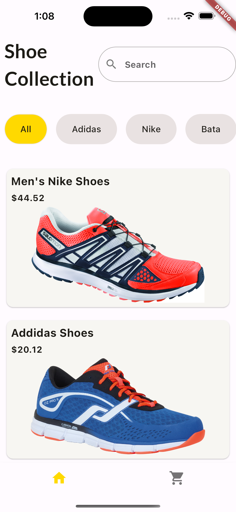
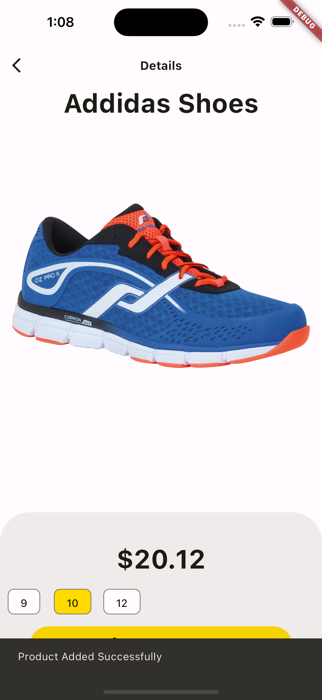
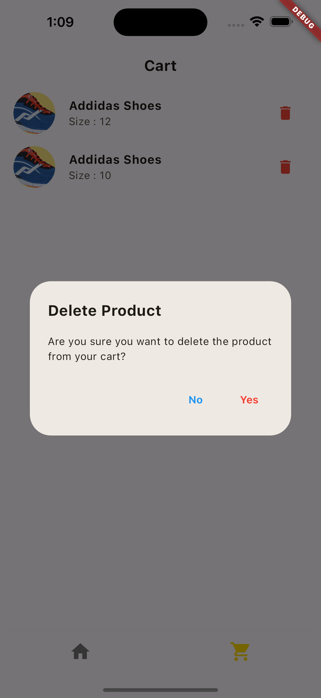

# ShoeFiesta
ShoeFiesta, a dynamic e-commerce Flutter app that revolutionizes your shoe shopping experience. Utilizing advanced features like Provider for state management, efficient navigation, and ListView Builder and Inherited Widget concept, users can effortlessly add desired shoes to their cart. The app also incorporates AlertDialogs for a smooth and interactive shopping journey. 
# Screenshot of ShoeFiesta

